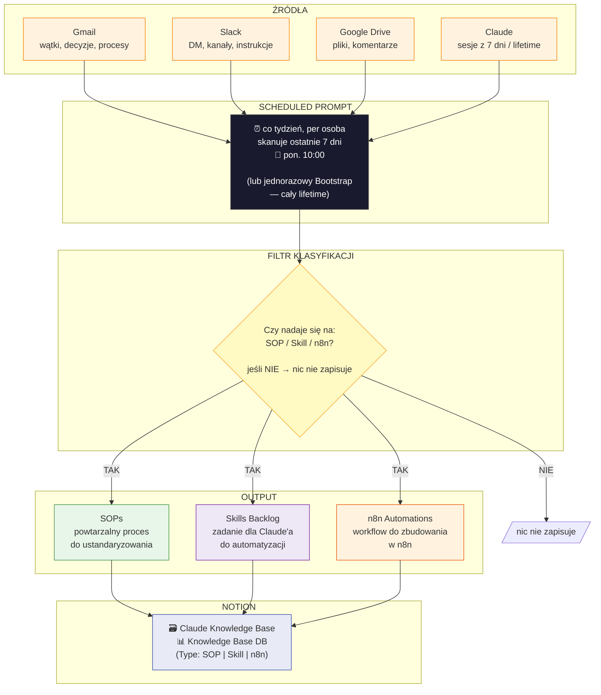
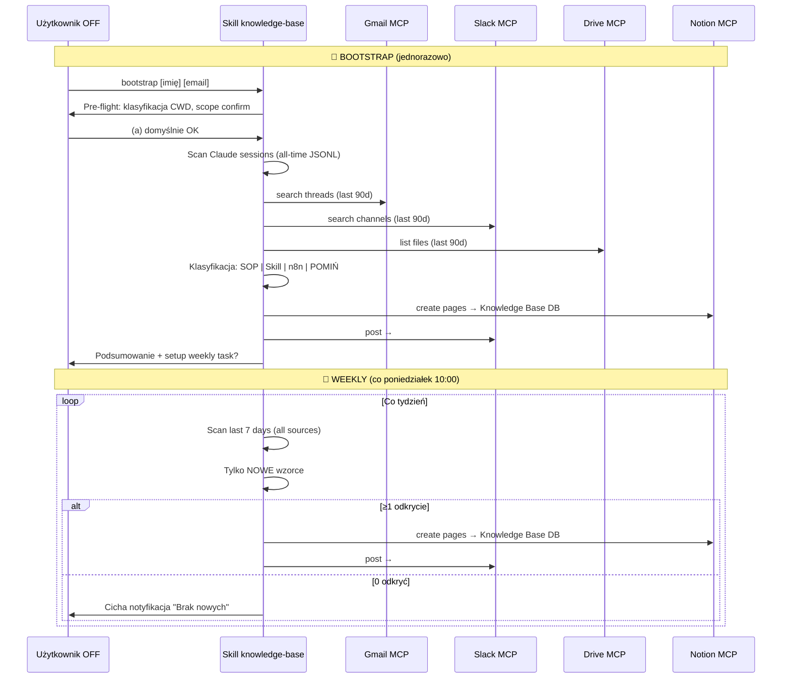
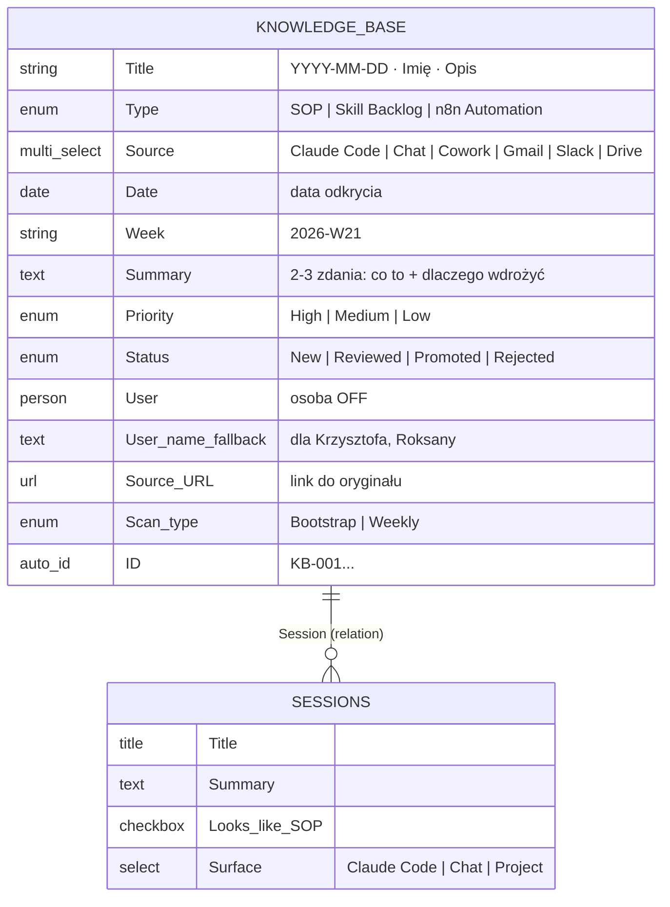
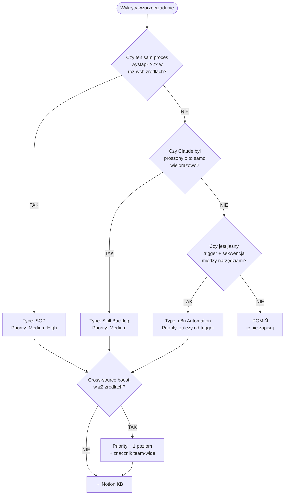

# Knowledge Base — Diagram przepływu danych

## Główny flow (weekly + bootstrap)

---

## Sekwencja Bootstrap vs Weekly

---

## Anatomia wpisu Knowledge Base

---

## Decision tree: klasyfikacja odkrycia

---

## Gdzie szukać odpowiedzi na pytania biznesowe

| Pytanie | Gdzie patrzeć |
|---|---|
| Jakie procesy zespołu można ustandaryzować? | Knowledge Base DB → filter Type=SOP, Status=New |
| Co warto zbudować jako skill Claude? | Knowledge Base DB → filter Type=Skill Backlog, Priority=High |
| Jakie automatyzacje n8n warto wdrożyć? | Knowledge Base DB → filter Type=n8n Automation |
| Kto ma najwięcej odkryć? | Knowledge Base DB → group by User |
| Co było High priority w tym tygodniu? | Knowledge Base DB → filter Week=bieżący, Priority=High |
| Które wzorce powtarzają się u wielu osób? | Knowledge Base DB → filter Title contains "team-wide" |
| Jaka jest historia odkryć? | Knowledge Base DB → sort by Date ASC |

---

*FLOW.md v1.0 · knowledge-base · msm-glitch/knowledge-base*
