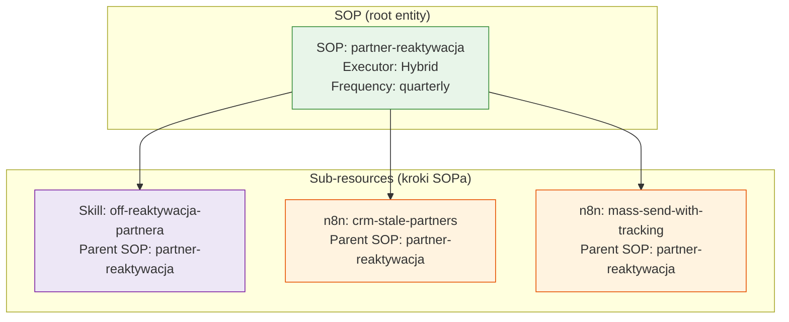
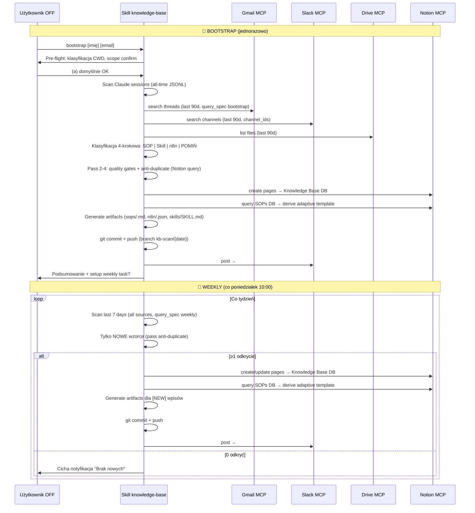
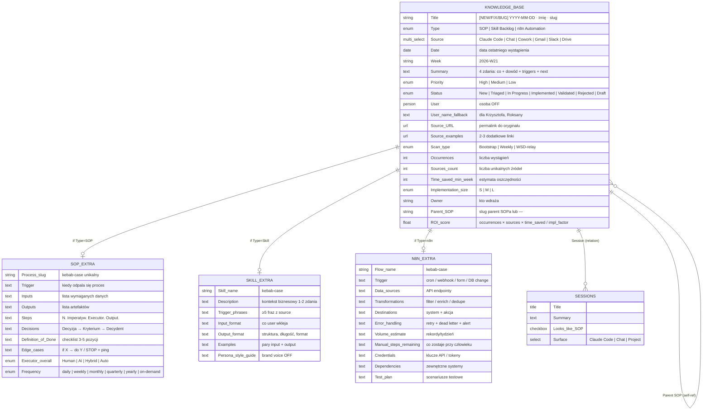
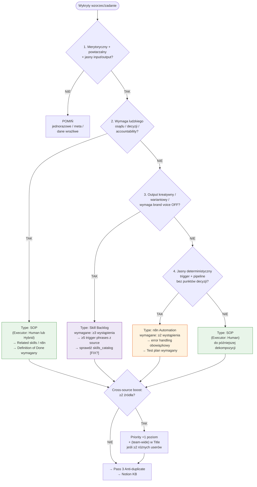

# Knowledge Base — Diagram przepływu danych

## Hierarchia encji: SOP root → Skill/n8n sub-resources



SOP bez Parent SOP = **root**. Skill/n8n wskazują Parent SOP slugiem — lub `—` jeśli standalone.

---

## Główny flow (weekly + bootstrap)

```mermaid
flowchart TD
    subgraph ŹRÓDŁA["ŹRÓDŁA"]
        A1[Gmail\nwątki, decyzje, procesy]:::source
        A2[Slack\nDM, kanały, instrukcje]:::source
        A3[Google Drive\npliki, komentarze]:::source
        A4[Claude\nsesje z 7 dni / lifetime]:::source
    end

    subgraph SCAN["SCHEDULED PROMPT"]
        B["⏰ co tydzień, per osoba\nskanuje ostatnie 7 dni\n📅 pon. 10:00\n\n(lub jednorazowy Bootstrap\n— cały lifetime)"]:::scheduled
    end

    subgraph FILTER["FILTR KLASYFIKACJI"]
        C{"Rozłączne drzewo 4-krokowe:\n1) merytoryczne?\n2) ludzki osąd → SOP\n3) kreatywny output → Skill\n4) deterministyczny → n8n"}:::decision
    end

    subgraph OUTPUT["OUTPUT"]
        D1[SOPs\npowtarzalny proces\nz Decision of Done]:::sop
        D2[Skills Backlog\n≥3 wystąpienia\ntrigger phrases z source]:::skill
        D3[n8n Automations\n≥2 wystąpienia\nerror handling wymagany]:::n8n
    end

    subgraph NOTION["NOTION"]
        E["🗃️ Claude Knowledge Base\n📊 Knowledge Base DB\n(Type: SOP | Skill | n8n)\nParent SOP — relacja"]:::notion
    end

    subgraph ARTIFACTS["ARTEFAKTY (auto-gen, Krok 4.5)"]
        F1[artifacts/sops/{slug}.md\ntemplate z prior SOPs]:::sop
        F2[artifacts/n8n/{slug}.json\nworkflow skeleton]:::n8n
        F3[artifacts/skills/{slug}/SKILL.md\nfrontmatter + body]:::skill
    end

    A1 & A2 & A3 & A4 --> B
    B --> C
    C -->|TAK| D1 & D2 & D3
    D1 & D2 & D3 --> E
    E -->|"[NEW] only"| F1 & F2 & F3
    C -->|NIE / poniżej progu| G[/nic nie zapisuje\nlub candidate_flag/]

    classDef source fill:#fff3e0,stroke:#f57c00,color:#333
    classDef scheduled fill:#1a1a2e,stroke:#444,color:#fff
    classDef decision fill:#fff9c4,stroke:#f9a825,color:#333
    classDef sop fill:#e8f5e9,stroke:#388e3c,color:#333
    classDef skill fill:#ede7f6,stroke:#7b1fa2,color:#333
    classDef n8n fill:#fff3e0,stroke:#e65100,color:#333
    classDef notion fill:#e8eaf6,stroke:#3949ab,color:#333
```

---

## Sekwencja Bootstrap vs Weekly



---

## Anatomia wpisu Knowledge Base



---

## Decision tree: klasyfikacja odkrycia (rozłączny, 4-krokowy)



---

## Gdzie szukać odpowiedzi na pytania biznesowe

| Pytanie | Gdzie patrzeć |
|---|---|
| Jakie procesy zespołu można ustandaryzować? | Knowledge Base DB → filter Type=SOP, Status=New |
| Co warto zbudować jako skill Claude? | Knowledge Base DB → filter Type=Skill Backlog, Priority=High |
| Jakie automatyzacje n8n warto wdrożyć? | Knowledge Base DB → filter Type=n8n Automation |
| Kto ma najwięcej odkryć? | Knowledge Base DB → group by User |
| Co było High priority w tym tygodniu? | Knowledge Base DB → filter Week=bieżący, Priority=High |
| Które wzorce powtarzają się u wielu osób? | Knowledge Base DB → filter Title contains "team-wide" |
| Jaka jest historia odkryć? | Knowledge Base DB → sort by Date ASC |
| Które Skille i n8n należą do jednego procesu? | Knowledge Base DB → filter Parent SOP = {slug} |

---

*FLOW.md v1.1 · knowledge-base · msm-glitch/knowledge-base*
